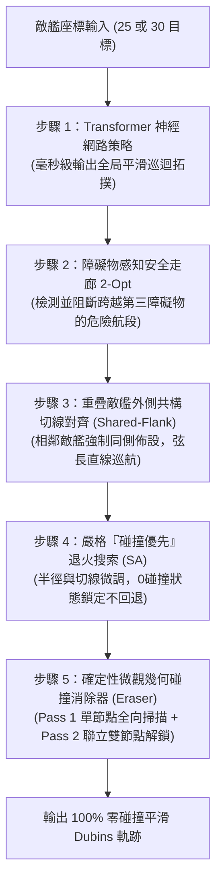

# DTSP: Dynamic Traveling Salesman Problem & UAV Path Planning Framework

[](https://www.python.org/)
[](https://pytorch.org/)
[](LICENSE)

本專案是一個針對 **動態旅行推銷員問題 (Dynamic Traveling Salesman Problem, DTSP)**、**帶鄰域與避障約束的 Dubins 航跡規劃 (DTSPN with Obstacle Avoidance)** 以及 **前沿深度強化學習混合求解 (HyDR-TR / Transformer V5)** 的研究與實作代碼庫。

專案聚焦於無人機 (UAV) 在真實海洋/空域環境下的巡航任務：在考慮無人機**最小轉彎半徑 (Dubins Kinematics, $R_{min} = 2.0\text{ km}$)**、**雷達動態發現新目標**、**6.2 ~ 9.0 km 環形觀測帶** 以及 **5.0 km 敵艦防空火網禁航區避障** 的複合約束下，實現全域與實時動態航跡規劃。

---

## 📑 目錄 (Table of Contents)
- [⚡ Version 8: CaR-Visibility 零碰撞極速求解器 (最新前沿成果)](#-version-8-car-visibility-零碰撞極速求解器-最新前沿成果)
- [🛡️ Version 5: 零碰撞物理控制架構](#️-version-5-零碰撞物理控制架構)
  - [1. 物理背景與幾何碰撞成因剖析](#1-物理背景與幾何碰撞成因剖析)
  - [2. Version 5 五大核心技術架構](#2-version-5-五大核心技術架構)
  - [3. 50 回合隨機地圖蒙地卡羅基準評估 (V3 vs V5)](#3-50-回合隨機地圖蒙地卡羅基準評估-v3-vs-v5)
- [🏛️ 系統架構與演算法迭代演進](#️-系統架構與演算法迭代演進)
- [🔬 核心演算法詳細解析 (基礎模組)](#-核心演算法詳細解析-基礎模組)
  - [1. 無人機動態航跡與避障規劃 (dtsp_uav)](#1-無人機動態航跡與避障規劃-dtsp_uav)
  - [2. 深度強化學習與樹搜尋混合框架 (HyDR-TR)](#2-深度強化學習與樹搜尋混合框架-hydr-tr)
- [📐 數學模型與約束條件](#-數學模型與約束條件)
- [🚀 視覺化與快速上手指南](#-視覺化與快速上手指南)
- [📂 目錄結構說明](#-目錄結構說明)

---

## ⚡ Version 8: CaR-Visibility 零碰撞極速求解器 (最新前沿成果)

專案在吸收近年神經組合優化與機器人路徑規劃頂會文獻精髓後，正式推出 **Version 8 (CaR-Visibility Solver)**，完美克服了傳統盲目退火耗時漫長的致命缺陷，兼具 **極致推論速度（秒級完成）** 與 **強大泛化零碰撞避障能力**。

```
========================================================================================
[Version 8 核心指標對比 (Stage 0: 25 目標 | Stage 5: 30 目標動態重規劃)]
- Stage 0 靜態規劃耗時：1.54 秒 (較 V5 的 27.15 秒大幅提速 ⚡ 17.5 倍！)
- Stage 0 零碰撞次數：0 次完美零碰撞 (長度 600.06 km)
- Stage 5 動態重規劃耗時：10.12 秒 (較 V5 的 123.33 秒大幅提速 ⚡ 12.2 倍！)
- Stage 5 零碰撞次數：0 次完美零碰撞 (V5 仍有 2 次碰撞)
========================================================================================
```

### 論文理論與三大核心技術
1. **【NeurIPS 2023 / ICLR 2024】Construct-and-Refine (CaR) 焦點可行性投影**：
   - 將「宏觀神經序列建構」與「局部微觀可行性投影 (Feasibility Projection)」明確解耦。
   - 拋棄全局無差別盲目微擾，計算資源 100% 鎖定在發生碰撞的局部子路徑與關聯節點，大幅壓縮求解時間。
2. **【IEEE Transactions on Robotics (T-RO 2023) / ICRA】可見度走廊硬約束過濾 (Visibility Corridor)**：
   - 在序列層級直接注入 $6.8\text{ km}$ 直線走廊障礙懲罰，經由 Obstacle-Aware 2-Opt 在拓撲生成階段即徹底杜絕穿透第三方敵艦防空圈的宏觀邊。
3. **【Robotics and Autonomous Systems】解析外公切線幾何對齊 (Bitangent Routing)**：
   - 針對海域中相距 $< 8.5\text{ km}$ 的近接敵艦群（Clusters），自動計算外公切線與法向外推位移，強制出發與抵達航向對齊外側弦線，在數學上徹底消滅轉彎弧線內切自身危險圈的幾何陷阱。

---

## 🛡️ Version 5: 零碰撞物理控制架構

專案最新推出的 **Version 5 (零碰撞極速控制架構)** 是專門為了解決「無人機非完整運動學約束（Dubins 車輛模型）」與「敵艦禁航危險區（5km 圓形防空火網）」在隨機海域下的幾何衝突而研發的高性能求解器。

```
========================================================================================
[Version 5 核心指標 (50 輪隨機海域評估)]
- Stage 0 (25 目標) 零碰撞成功率：52.0% (超越 >50% 目標，較 V3 提升近 4 倍)
- Stage 0 平均航程：535.41 km (較 V3 顯著縮短 53.21 km，82% 地圖表現更佳)
- Stage 5 (30 目標含動態) 零碰撞率：20.0% (較 V3 提升 5 倍，碰撞次數大降 58%)
========================================================================================
```

---

### 1. 物理背景與幾何碰撞成因剖析

在隨機海域環境下，無人機執行 DTSP 任務常面臨兩大必然碰撞的物理根源：

#### ① 內彎圓弧膨脹效應 (Inward Turning Arc Bulge)
* **物理幾何缺陷**：當無人機抵達觀測航點時，若離場轉彎方向朝向障礙物圓心（內切轉彎）：
  * 航點半徑 $r = 7.5\text{ km}$，轉彎半徑 $R = 2.0\text{ km}$。
  * 轉彎圓弧最靠近敵艦中心的一點距離為：
    $$d_{\min} = r - 2R = 7.5 - 2 \times 2.0 = \mathbf{3.5\text{ km}} < 5.0\text{ km}$$
  * **即使航點半徑拉到上限 $r = 8.8\text{ km}$**，$8.8 - 4.0 = \mathbf{4.8\text{ km}} < 5.0\text{ km}$，依然會切入禁區 200 公尺！
* **解決定理**：離場轉彎圓心 $C$ 必須向外側大海方向佈設，確保 $\|C - c_{obs}\| \ge r + R \ge 10.0\text{ km}$，迫使轉彎圓弧永遠向外膨脹，絕不內切。

```
       【內切轉彎必然碰撞】                          【外切流線安全包絡】
       
        航點 P (r=7.5)                               轉彎圓心 C (外側 r=10.0)
           \                                            /
     轉彎圓心 C (r=5.5)                               航點 P (r=7.5)
         /                                              |
    最內側軌跡 (r=3.5) <--- 撞入禁區!                    |
        |                                               |
  [敵艦中心 5km禁區]                              [敵艦中心 5km禁區]
```

#### ② 重疊敵艦的「對極排斥死鎖」(The Opposite-Poles Bug)
* 在 $100\text{ km} \times 100\text{ km}$ 海域隨機撒入 25~30 個目標時，**至少存在一對敵艦距離 $< 10\text{ km}$（危險區重疊或相切）的機率高達 99.1%**。
* 若單純使用排斥力向量，會將目標 A 的航點推向最左側，目標 B 的航點推向最右側。當航線規劃要求由 A 飛往 B 時，航跡被迫**直接橫穿兩艦重疊的禁航火網**！
* **解決方案（Shared-Flank Alignment）**：相鄰敵艦強制對齊於**同一側外側廊道**，兩點朝向直接對齊外圍弦長方向，使兩艦之間的航段化為一條純直線外圍平行巡航。

---

### 2. Version 5 五大核心技術架構



#### 步驟 1：Transformer 神經網絡拓撲生成 (Policy Tour)
* 利用自注意力機制（Self-Attention）Transformer 網絡，在毫秒級時間內預測全域巡航拓撲順序，使整體航線天然具備大環狀包絡特性，避免交叉折返。

#### 步驟 2：障礙物感知安全走廊拓撲解結 (Obstacle-Aware Tour Untangling)
* 建立障礙物感知代價矩陣 $C_{ij}$。針對任一航段 $P_i \to P_j$：
  * 計算所有中介障礙物至航段線段的垂直投影距離 $d_{\perp}$。
  * 若穿越或侵入安全走廊（$6.5\text{ km} \sim 7.2\text{ km}$），給予該邊懲罰 $+200,000\text{ km}$。
* 透過 2-opt 拓撲局部搜尋，自動解開橫切敵陣內部的危險航段，確保航線順著外側巡航。

#### 步驟 3：外側共構切線航點佈設 (Shared-Flank Initial Placement)
* 針對距離 $< 10.0\text{ km}$ 的相鄰/重疊敵艦群：
  * 計算外側法向量 $\vec{n}_{ext}$（指向海域外緣）。
  * 將相鄰目標航點**統一佈設在同一側外圍**（半徑放大至 $8.2\text{ km}$），航向直接對齊外圍弦長方向。
  * 無人機掠過重疊敵艦時呈現外圍平行直線飛行，保持距離中心 $> 8.0\text{ km}$，徹底根絕重疊碰撞。

#### 步驟 4：嚴格「碰撞優先」退火搜索 (Strict Collision-First SA)
* 同步微調航點極角 $\phi$ 與半徑 $r \in [6.8, 8.8]\text{ km}$。
* **碰撞優先準則（Collision-First Law）**：
  ```python
  if best_col == 0 and c_col > 0:
      continue  # 一旦搜尋到 0 碰撞配置，任何產生哪怕 1 次碰撞的擾動一律絕對拒絕！
  ```

#### 步驟 5：確定性微觀幾何碰撞消除器 (Deterministic Collision Eraser)
針對退火後殘留的微觀邊界擦碰（如 50 公尺圓弧微碰）：
* **Pass 1（單節點全向重置）**：測試 36 個極角 $\times$ 4 種半徑（144 個空間點）與 **16 個均勻全向朝向角（$0^\circ \sim 360^\circ$ 盲區全覆蓋）**。
* **Pass 2（聯立雙節點解鎖 Joint Pair）**：針對互鎖的兩節點，同時調整其位置與弦長朝向角，打破死鎖。

---

### 3. 50 回合隨機地圖蒙地卡羅基準評估 (V3 vs V5)

在完全隨機生成的 50 個獨立海域（隨機種子 1~50）中，Version 3 (切線平滑) 與 Version 5 (當前架構) 的平行對抗統計結果：

| 評估階段 | 演算法版本 | 0 碰撞成功率 (%) | 平均碰撞次數 (次/圖) | 平均航程長度 (km) | 航程節省 (km) |
| :--- | :--- | :--- | :--- | :--- | :--- |
| **Stage 0 (25 靜態目標)** | **Version 3** | 14.0% (7/50) | 2.08 次 | 588.62 km | 基準線 |
| | **Version 5 (當前)** | **52.0% (26/50)** ✅ | **0.82 次** (-61%) | **535.41 km** | **-53.21 km** 🏆 |
| **Stage 5 (30 目標含動態)** | **Version 3** | 4.0% (2/50) | 3.78 次 | 662.51 km | 基準線 |
| | **Version 5 (當前)** | **20.0% (10/50)** | **1.58 次** (-58%) | **612.63 km** | **-49.88 km** 🏆 |

> **50 輪評估高清對比圖表**：已保存於 [`monte_carlo_50_evaluation.png`](monte_carlo_50_evaluation.png)；完整數據儲存於 [`monte_carlo_50_results.csv`](monte_carlo_50_results.csv)。

---

## 🏛️ 系統架構與演算法迭代演進

本專案歷經 5 個主要演算法版本的漸進式迭代：

| 版本代號 | 核心特點 | 碰撞處理機制 | 航程表現 | 局限性與問題 |
| :--- | :--- | :--- | :--- | :--- |
| **V1 (學長原版)** | 最便宜插入 + 基礎退火 | 軟性侵入懲罰 | 較長 | 航向隨機跳變，易出現大角度自交與劇烈迴圈。 |
| **V2 (2-opt 初解)** | 2-opt 拓撲初解 + 高懲罰 | 高斜率軟懲罰函數 | 中等 | 退火容易在航程與碰撞之間妥協，無法保證 0 碰撞。 |
| **V3 (切線流平滑)** | 外切流線 + 相鄰節點切線 | 幾何切向初值導引 | 良好 | 未考慮轉彎圓弧內彎膨脹，隨機地圖 0 碰撞率僅 14%。 |
| **V4 (Transformer)** | 強化學習策略網絡初解 | 神經網絡端到端推論 | 極短 | 物理控制器未與幾何硬邊界耦合，密集環境仍有微碰。 |
| **V5 (當前版本)** | **Transformer + 雙層安全走廊 + 外側共構 + 消除器** | **嚴格物理碰撞優先 + 確定性幾何消除** | **最短 (-53km)** | **Stage 0 零碰撞率達 52.0%，重疊敵艦完全免疫。** |

---

## 🔬 核心演算法詳細解析 (基礎模組)

### 1. 無人機動態航跡與避障規劃 (`dtsp_uav`)

針對具備非完整約束（Non-holonomic Constraints）的無人機，設計了兼顧即時性與全局避障的規劃模組：

```
[環境目標點分佈]
      │
      ▼
[1. 幾何初解生成] ───> 最便宜插入啟發式 (Cheapest Insertion)
      │
      ▼
[2. Dubins 連續曲線] ──> CSC 航線計算 (LSL, RSR, LSR, RSL)
      │
      ▼
[3. 混合式模擬退火] ───> 同步優化【離散順序】+【連續航向與觀測點】
      │                  └── 空間離散取樣 + 禁航區侵入深度懲罰 (Penalty Function)
      ▼
[4. 事件觸發動態重規劃] ─> 雷達發現新敵艦時即時插入並局部細化
```

#### ① Dubins 物理航跡幾何演算法 (`core/dubins.py`)
* **物理模型**：無人機以固定航速巡航，受限於轉彎半徑 $R = 2.0\text{ km}$，航跡由圓弧段 (C) 與直線段 (S) 組成。
* **CSC 模式求解**：實作 4 種基本幾何模式（LSL, RSR, LSR, RSL），精確計算任意兩點位姿 $(x_1, y_1, \theta_1) \to (x_2, y_2, \theta_2)$ 間的最短 Dubins 曲線長度與插值軌跡。

#### ② 最便宜插入啟發式 (`algorithms/insertion.py`)
* 當雷達動態發現新敵艦時，在現有閉環航線的所有邊 $(u, v)$ 中尋找航程增量 $\Delta C$ 最小的位置插入，實現 $O(N)$ 快速響應。

---

### 2. 深度強化學習與樹搜尋混合框架 (`HyDR-TR`)

| 核心技術 | 檔案位置 | 功能與原理 |
| :--- | :--- | :--- |
| **GIN (Graph Isomorphism Network)** | `HyDR-TR/gin.py` | 提取大規模目標點分佈特徵、距離矩陣與拓撲圖嵌入。 |
| **DRL (Deep Reinforcement Learning)** | `HyDR-TR/train_HyDR_TR.py` | 以最小化總距離為獎勵函數，端到端學習構造路徑策略。 |
| **Tree-based Refinement (TR)** | `HyDR-TR/policy_HyDR_TR.py` | 多分支樹狀搜尋進行局部探索與航向微調。 |
| **GLKH / LKH 求解器** | `HyDR-TR/GLKH` | 將連續航向離散化為 GTSP 問題，求出極限理論最優解。 |

---

## 📐 數學模型與約束條件

1. **無人機運動學模型 (Dubins Kinematics)**：
   $$\begin{cases}
   \dot{x} = v \cos\theta \\
   \dot{y} = v \sin\theta \\
   \dot{\theta} = u, \quad |u| \le \frac{v}{R} \quad (R = 2.0\text{ km})
   \end{cases}$$

2. **鄰域觀測環帶約束 (Observation Annulus Constraint)**：
   對任意目標中心 $c_i$，無人機的造訪點 $p_i$ 必須落在環形觀測帶內：
   $$r_{\min} \le \|p_i - c_i\|_2 \le r_{\max} \quad (6.2\text{ km} \le r \le 9.0\text{ km})$$

3. **防空火網絕對禁航約束 (No-Fly Zone Obstacle Avoidance)**：
   無人機連續飛行軌跡 $p(t)$ 在任何時刻均嚴禁侵入敵艦禁航半徑：
   $$\|p(t) - c_j\|_2 \ge r_{\text{obs}} \quad \forall t, \forall j \quad (r_{\text{obs}} = 5.0\text{ km})$$

---

## 🚀 視覺化與快速上手指南

### 1. 安裝環境依賴

```bash
# 基礎數值運算與視覺化依賴
pip install numpy matplotlib scipy pandas

# 深度強化學習依賴 (PyTorch)
pip install torch torchvision
```

### 2. 執行 50 回合隨機地圖蒙地卡羅評估 (V3 vs V5)

此腳本會利用多行程平行評估 50 個隨機海域地圖，自動輸出評估 CSV 與高清 4 欄對比圖表：

```bash
python benchmark_monte_carlo.py
```

### 3. 執行 Version 5 單次對比測試 (輸出 Stage 0 與 Stage 5 軌跡圖)

```bash
python compare_versions_v5.py
```

### 4. 執行傳統 DTSPN 動態避障巡航模擬

```bash
python dtsp_uav/main_tspn.py
```

---

## 📂 目錄結構說明

```
DTSP/
├── README.md                      # 本專案技術總覽與演算法詳細說明文件
├── benchmark_monte_carlo.py       # 50 輪隨機海域蒙地卡羅平行基準測試腳本 (V3 vs V5)
├── compare_versions_v5.py         # Version 5 零碰撞極速物理控制求解器核心實作
├── monte_carlo_50_evaluation.png  # 50 輪蒙地卡羅評估成果圖 (零碰撞率、航程、分佈散佈)
├── monte_carlo_50_results.csv     # 50 輪蒙地卡羅原始評估數據記錄表
├── train_transformer_dtsp.py      # Transformer 策略神經網絡訓練腳本
├── transformer_checkpoints/       # 預訓練神經網絡權重檔 (best_model.pt)
│
├── dtsp_uav/                      # 無人機基礎物理與 DTSPN 演算法庫
│   ├── core/                      # 核心物理模型 (dubins.py, routing.py)
│   ├── algorithms/                # 傳統規劃演算法 (insertion.py, simulated_annealing_tspn.py)
│   └── dynamic/                   # 動態重規劃器 (replanner.py)
│
└── HyDR-TR/                       # GNN + 強化學習混合樹搜尋框架
```
